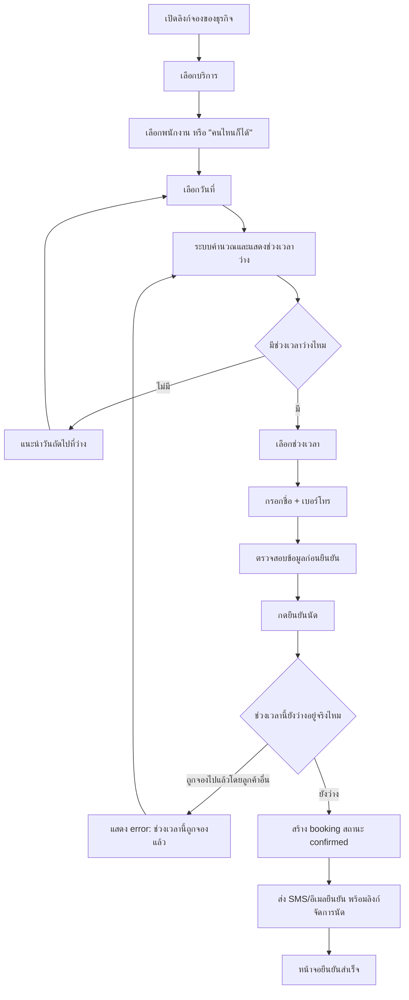

# User Flow — Customer Booking

> ตัวอย่างเอกสารสมบูรณ์ (product สมมติ) — ใช้เป็นแม่แบบสำหรับโปรเจกต์อื่น

## Status

| Field | Value |
|---|---|
| Document Status | Approved |
| Owner | UX/UI Designer |
| Reviewer | Product Owner, Tech Lead |
| Last Updated | 2026-01-22 |
| Related | [Design Brief](../00_design_brief/design_brief.md), [Functional Requirements FR-004/FR-005](../../04_requirements/functional_requirements.md), [Business Rules BR-001/BR-005](../../04_requirements/business_rules.md) |

---

## 1. Scope

Flow นี้ครอบคลุมการจองนัดของลูกค้าผ่านหน้าเว็บสาธารณะของธุรกิจ (ไม่ต้อง login) ตั้งแต่เปิดลิงก์จนได้รับข้อความยืนยัน รวมถึง edge case ที่ช่วงเวลาถูกจองไปแล้วระหว่างที่ลูกค้ากำลังกรอกฟอร์ม (double booking)

หน้าจอที่เกี่ยวข้อง → [Screen Spec: Public Booking Page](../04_screen_specs/screen_spec_public_booking_page.md)

## 2. Flowchart

## 3. Narrative

1. **เปิดลิงก์ (A):** ลูกค้าเปิดลิงก์/QR ที่ธุรกิจแจก (ไม่ต้องสร้างบัญชี) เห็นชื่อร้าน เวลาทำการ และรายการบริการ
2. **เลือกบริการ (B):** เลือกบริการที่ต้องการ ระบบจะรู้ระยะเวลาที่ต้องใช้จากตรงนี้ ใช้คำนวณ availability ในขั้นถัดไป
3. **เลือกพนักงาน (C):** เลือกพนักงานคนใดคนหนึ่งที่ให้บริการนี้ได้ หรือเลือก "คนไหนก็ได้" เพื่อให้ระบบจับคู่พนักงานที่ว่างที่สุด
4. **เลือกวันและเวลา (D–G):** ระบบคำนวณช่วงเวลาว่างสดจากเวลาทำการร้าน หัก booking ที่มีอยู่ และระยะเวลาบริการ (อ้างอิง [BR-005](../../04_requirements/business_rules.md#br-005--availability-ต้องคำนวณจากเวลาทำการ--booking-ที่มีอยู่เสมอ)) — ห้าม cache ไว้นานเกิน 60 วินาที เพื่อลดโอกาส double booking จากข้อมูลเก่า
5. **กรอกข้อมูล (H):** กรอกแค่ชื่อและเบอร์โทร (หรืออีเมล) — ไม่บังคับสร้างบัญชี ไม่ถามข้อมูลเกินจำเป็น
6. **ยืนยัน (I–J):** แสดงสรุปนัด (บริการ/พนักงาน/วันเวลา/ราคา) ให้ลูกค้าตรวจอีกครั้งก่อนกดยืนยันจริง
7. **ตรวจสอบซ้ำที่ server (K):** ระบบต้องเช็ค availability อีกครั้งที่ระดับ database ตอนกดยืนยัน (transaction/unique constraint) ไม่พึ่งพาข้อมูลที่โหลดไว้ตอนต้น เพราะเวลาผ่านไปตั้งแต่เปิดหน้าจนกดยืนยันอาจมีคนอื่นจองตัดหน้า
8. **สร้าง booking (M–N):** เมื่อผ่านการตรวจสอบ ระบบสร้าง booking สถานะ `confirmed` และส่งข้อความยืนยันทันที พร้อมลิงก์จัดการนัด (ใช้ในภายหลังสำหรับเลื่อน/ยกเลิก → [Cancellation Flow](cancellation_flow.md))

## 4. Edge Case: Double Booking ระหว่างกรอกฟอร์ม

**สถานการณ์:** ลูกค้า A เลือกช่วงเวลา 14:00 กับพนักงาน B แล้วใช้เวลากรอกชื่อ-เบอร์โทรอยู่ 2 นาที ในระหว่างนั้นลูกค้า C จองช่วงเวลาเดียวกันกับพนักงาน B สำเร็จก่อน

**พฤติกรรมที่ต้องการ:**

- ระบบต้องปฏิเสธการสร้าง booking ของลูกค้า A ที่ระดับ database (unique constraint ต่อ staff + time range สถานะ active) ไม่ใช่เช็คแค่ตอนโหลดหน้า (อ้างอิง [BR-001](../../04_requirements/business_rules.md#br-001--ห้ามจองชนกัน-double-booking))
- UI แสดงข้อความ error ที่สุภาพและพาไปแก้ปัญหาทันที เช่น "ช่วงเวลา 14:00 ถูกจองไปแล้ว ลองเลือกเวลาอื่นดูนะครับ" — **ไม่** ใช้ข้อความเชิงเทคนิค เช่น "409 Conflict"
- หลังแสดง error ต้อง refresh รายการช่วงเวลาว่างให้ลูกค้าเห็นตัวเลือกที่ยังว่างจริง ณ ขณะนั้น ไม่ให้ลูกค้าต้องกดยืนยันซ้ำแล้วเจอ error วนซ้ำ
- ข้อมูลชื่อ/เบอร์โทรที่กรอกไว้ต้องยังอยู่ (ไม่ต้องให้ลูกค้ากรอกใหม่ทั้งหมด) — เปลี่ยนแค่ช่วงเวลา

## 5. Edge Cases อื่นๆ ที่ต้องออกแบบรองรับ

| สถานการณ์ | พฤติกรรมที่ต้องการ |
|---|---|
| วันที่เลือกร้านปิด (นอกเวลาทำการ) | ไม่แสดงช่วงเวลาว่างเลย พร้อมข้อความ "ร้านปิดวันนี้" และปุ่มเลือกวันอื่น |
| บริการที่เลือกไม่มีพนักงานคนใดให้บริการได้ในวันนั้น | แสดงข้อความ "ยังไม่มีเวลาว่างสำหรับบริการนี้ในวันที่เลือก" พร้อมแนะนำวันถัดไป |
| กรอกเบอร์โทรผิดรูปแบบ | แสดง inline error ทันทีที่ field โดยไม่ต้องรอกดยืนยันทั้งฟอร์ม |
| เครือข่ายขัดข้องตอนกดยืนยัน | แสดงปุ่ม "ลองใหม่" และไม่สร้าง booking ซ้ำถ้าลูกค้ากดยืนยันหลายครั้ง (idempotent submit) |

## 6. Related Docs

- [Design Brief](../00_design_brief/design_brief.md)
- [Screen Spec: Public Booking Page](../04_screen_specs/screen_spec_public_booking_page.md)
- [Cancellation Flow](cancellation_flow.md)
- [Staff Schedule Flow](staff_schedule_flow.md)
- [Functional Requirements](../../04_requirements/functional_requirements.md)
- [Business Rules](../../04_requirements/business_rules.md)
