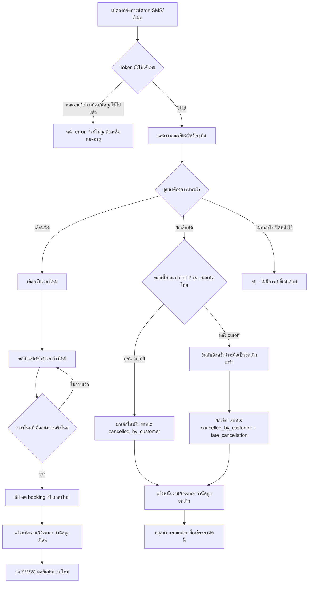

# User Flow — Reschedule & Cancellation

> ตัวอย่างเอกสารสมบูรณ์ (product สมมติ) — ใช้เป็นแม่แบบสำหรับโปรเจกต์อื่น

## Status

| Field | Value |
|---|---|
| Document Status | Approved |
| Owner | UX/UI Designer |
| Reviewer | Product Owner, Tech Lead |
| Last Updated | 2026-01-22 |
| Related | [Booking Flow](booking_flow.md), [Business Rules BR-002](../../04_requirements/business_rules.md), [Functional Requirements FR-006](../../04_requirements/functional_requirements.md), [Permission Requirements PERM-003](../../04_requirements/permission_requirements.md) |

---

## 1. Scope

Flow นี้ครอบคลุมการที่ลูกค้าเลื่อนหรือยกเลิกนัดด้วยตัวเอง ผ่านลิงก์จัดการนัดที่ส่งมาพร้อมข้อความยืนยันการจอง (หรือข้อความแจ้งเตือนก่อนนัด 24 ชม./1 ชม.) รวมถึง branch ของ cutoff time สำหรับยกเลิก/เลื่อนฟรี

Owner และ Staff ก็เลื่อน/ยกเลิกนัดของลูกค้าแทนได้จากแดชบอร์ด (เช่นกรณีลูกค้าโทรมาแจ้ง) โดยใช้ตรรกะ cutoff เดียวกัน แต่เอกสารนี้โฟกัสที่ flow ฝั่งลูกค้าเป็นหลัก

## 2. Flowchart

## 3. Narrative

1. **เข้าถึงผ่าน token (A–C):** ลูกค้าไม่ต้อง login — เข้าหน้าจัดการนัดผ่าน token ที่ผูกกับ booking ID เดียว token หมดอายุอัตโนมัติ 30 วันหลัง booking เสร็จสิ้นหรือถูกยกเลิก (อ้างอิง [PERM-003](../../04_requirements/permission_requirements.md#permission-rules)) หากลิงก์ใช้ไม่ได้แล้ว (เช่นถูกใช้ยกเลิกไปแล้ว หรือหมดอายุ) ให้แสดงหน้า error ที่บอกสถานะจริง ไม่ใช่แค่ "404 Not Found"
2. **แสดงรายละเอียดนัด (D):** แสดงชื่อร้าน บริการ พนักงาน วันเวลา และปุ่ม "เลื่อนนัด" / "ยกเลิกนัด" ให้เห็นชัดเจนทั้งสองตัวเลือก
3. **เส้นทางเลื่อนนัด (F–L):** ลูกค้าเลือกวันเวลาใหม่จากช่วงเวลาว่างจริง (คำนวณสดเหมือนหน้าจองครั้งแรก) ระบบตรวจสอบ availability อีกครั้งตอนบันทึกเพื่อกันชนกับนัดอื่นที่เพิ่งเกิดขึ้น หากผ่านแล้วอัปเดต booking เดิม (ไม่สร้างนัดใหม่ ไม่ลบ audit trail เดิม) และแจ้งพนักงาน/Owner ทันที
4. **เส้นทางยกเลิกนัด — ตรวจ cutoff time (G):** ระบบเทียบเวลาปัจจุบันกับเวลานัด หากยังเหลือมากกว่าหรือเท่ากับ cutoff time ของธุรกิจนั้น (ค่า default 2 ชั่วโมง ปรับได้ต่อธุรกิจ) ให้ยกเลิกได้ฟรีทันที (อ้างอิง [BR-002](../../04_requirements/business_rules.md#br-002--cutoff-time-สำหรับยกเลิกเลื่อนนัดฟรี))
5. **หลัง cutoff (N–O):** ระบบยังอนุญาตให้ยกเลิกได้ (ไม่บล็อก) แต่ต้องแสดงคำอธิบายก่อนให้ลูกค้ายืนยันอีกครั้งว่า "การยกเลิกนี้อยู่หลังเวลาที่กำหนด (2 ชั่วโมงก่อนนัด) ระบบจะบันทึกเป็นการยกเลิกล่าช้า" แล้วบันทึกสถานะเป็น `late_cancellation` ควบคู่กับ `cancelled_by_customer` — MVP ยังไม่มีการหักค่าธรรมเนียมเพราะยังไม่มีระบบชำระเงิน
6. **แจ้งเตือนและปิด reminder (P–Q):** ทุกกรณี (เลื่อน/ยกเลิก) ต้องแจ้งพนักงานและ Owner ทันที และต้องยกเลิก reminder ที่ยังไม่ส่ง (24 ชม./1 ชม.) ของ booking เดิมทันที เพื่อไม่ให้ลูกค้าได้รับข้อความเตือนนัดที่ไม่มีอยู่แล้ว (อ้างอิง [BR-008](../../04_requirements/business_rules.md#br-008--reminder-ต้องหยุดทันทีเมื่อ-booking-ถูกยกเลิก))

## 4. UI Notes สำหรับ Cutoff Branch

- แสดงเวลานับถอยหลังหรือ label ชัดเจนว่า "ยกเลิกได้ฟรีถึง [เวลา]" เพื่อให้ลูกค้าตัดสินใจได้ก่อนกดจริง ไม่ใช่ให้เห็นผลลัพธ์หลังกดไปแล้วเท่านั้น
- ปุ่มยืนยันหลัง cutoff ควรใช้คำที่บอกผลลัพธ์ตรง ๆ เช่น "ยืนยันยกเลิก (บันทึกเป็นยกเลิกล่าช้า)" ไม่ใช้คำขู่หรือคำที่ทำให้รู้สึกผิด
- ถ้าลูกค้าเลื่อนนัดมากกว่า 1 ครั้ง ระบบยังใช้ตรรกะ cutoff เดิมกับเวลานัดล่าสุดเสมอ ไม่สะสมสิทธิ์การยกเลิกฟรี

## 5. Related Docs

- [Booking Flow](booking_flow.md)
- [Staff Schedule Flow](staff_schedule_flow.md)
- [Design Brief](../00_design_brief/design_brief.md)
- [Business Rules](../../04_requirements/business_rules.md)
- [Functional Requirements](../../04_requirements/functional_requirements.md)
- [Permission Requirements](../../04_requirements/permission_requirements.md)
