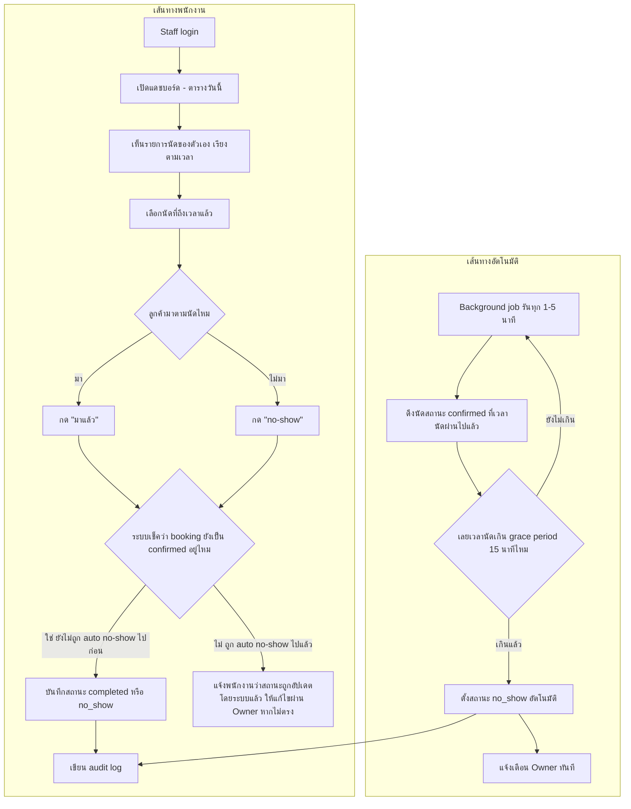

# User Flow — Staff Schedule & No-show Handling

> ตัวอย่างเอกสารสมบูรณ์ (product สมมติ) — ใช้เป็นแม่แบบสำหรับโปรเจกต์อื่น

## Status

| Field | Value |
|---|---|
| Document Status | Approved |
| Owner | UX/UI Designer |
| Reviewer | Product Owner, Tech Lead |
| Last Updated | 2026-01-22 |
| Related | [Business Rules BR-003/BR-004](../../04_requirements/business_rules.md), [Functional Requirements FR-008/FR-009](../../04_requirements/functional_requirements.md), [Permission Requirements](../../04_requirements/permission_requirements.md) |

---

## 1. Scope

Flow นี้ครอบคลุมสองเส้นทางที่เกิดขึ้นคู่กัน:

1. **เส้นทางพนักงาน:** login → เปิดตารางวันนี้ → ดูรายการนัดของตัวเอง → mark ว่า "มาแล้ว" (`completed`) หรือ "no-show" (`no_show`) หลังถึงเวลานัด
2. **เส้นทางระบบอัตโนมัติ:** background job ที่ตรวจนัดที่เลยเวลาไปแล้วเกิน grace period (15 นาที) โดยยังไม่มีการ mark สถานะ แล้วตั้งเป็น `no_show` ให้อัตโนมัติ

ทั้งสองเส้นทางแข่งกันเข้าถึง booking record เดียวกัน จึงต้องออกแบบให้ไม่ชนกัน (ดูหัวข้อ 4)

## 2. Flowchart

## 3. Narrative

1. **Login และเห็นเฉพาะของตัวเอง (A–C):** Staff login แล้วเห็นเฉพาะนัดที่ตัวเองถูก assign เป็น default ไม่เห็นนัดของพนักงานคนอื่น เว้นแต่ Owner ให้สิทธิ์ `view_all_bookings` เพิ่ม (อ้างอิง [BR-004](../../04_requirements/business_rules.md#br-004--staff-เห็นแก้ไขได้เฉพาะนัดของตัวเอง)) — กฎนี้บังคับที่ระดับ API ไม่ใช่แค่ซ่อนใน UI ดังนั้นแม้ Staff เดารูป URL ก็เข้าดูนัดคนอื่นไม่ได้
2. **เลือกนัดและ mark สถานะ (D–G):** เมื่อถึงเวลานัด (หรือหลังจากนั้น) พนักงานกด "มาแล้ว" หรือ "no-show" ได้จากรายการโดยตรง ไม่ต้องเข้าไปหน้ารายละเอียดหลายชั้น เพื่อให้ทำได้เร็วระหว่างทำงาน
3. **เช็คสถานะซ้ำก่อนบันทึก (H):** ก่อนบันทึกผลจากพนักงาน ระบบต้องเช็คว่า booking ยังเป็น `confirmed` อยู่หรือไม่ (ยังไม่ถูก background job เปลี่ยนเป็น `no_show` ไปก่อนแล้ว) — ดูรายละเอียดที่หัวข้อ 4
4. **Background job (L–P):** งานอัตโนมัติต้องรันถี่พอ (เอกสารนี้แนะนำทุก 1–5 นาที) เพื่อให้ grace period 15 นาทีมีความหมายจริง หาก booking ผ่านเวลานัดไปแล้วเกิน grace period และยังไม่ถูก mark เป็น `completed` ให้ตั้งเป็น `no_show` อัตโนมัติทันที (อ้างอิง [BR-003](../../04_requirements/business_rules.md#br-003--no-show-อัตโนมัติหลัง-grace-period)) และแจ้งเตือน Owner ทันทีที่เกิดขึ้น เพราะ Owner ต้องรู้เร็วเพื่อจัดการช่วงเวลาที่เหลือ (เช่น รับลูกค้า walk-in แทน)
5. **Audit log (K):** ทุกการเปลี่ยนสถานะ ไม่ว่าจากพนักงานหรือจาก background job ต้องเขียน audit log แบบ append-only พร้อม actor ที่ชัดเจน (ระบุว่าเป็น "Staff [ชื่อ]" หรือ "System — auto no-show job") เพื่อให้ตรวจสอบย้อนหลังได้ว่าใคร/อะไรเป็นคนเปลี่ยนสถานะ

## 4. Edge Case: Staff Mark พร้อมกับ Auto No-show Job

**สถานการณ์:** นัด 14:00 ผ่านไป 15 นาที 01 วินาที พอดีกับที่พนักงานกำลังจะกด "มาแล้ว" ในมือถือ — background job รันตัดหน้าไปตั้งสถานะ `no_show` ก่อนพนักงานกดสำเร็จ

**พฤติกรรมที่ต้องการ:**

- การอัปเดตสถานะทั้งสองทางต้องเป็น atomic operation ที่เช็คสถานะปัจจุบันก่อนเขียนทับ (optimistic lock / conditional update: "update เฉพาะถ้าสถานะยังเป็น confirmed") เพื่อไม่ให้ค่าสุดท้ายไม่ตรงกับความจริง
- ถ้า background job ชนะ (บันทึก `no_show` ไปแล้ว) และพนักงานกด "มาแล้ว" ทีหลังเสี้ยววินาที ระบบต้องแจ้งพนักงานว่า "ระบบบันทึกเป็น no-show ไปแล้วเนื่องจากเลยเวลา 15 นาที หากลูกค้ามาจริง ให้แจ้ง Owner เพื่อแก้ไขสถานะ" — ไม่ใช่ปล่อยให้พนักงานกดซ้ำแล้วเงียบไม่มีอะไรเกิดขึ้น
- การ "แก้ไข" สถานะที่ผิดพลาดในกรณีนี้ ให้เขียน audit event ใหม่แทนการย้อนไปแก้ event เดิม (อ้างอิง [BR-007](../../04_requirements/business_rules.md#br-007--audit-log-เป็น-append-only))

## 5. Related Docs

- [Booking Flow](booking_flow.md)
- [Cancellation Flow](cancellation_flow.md)
- [Design Brief](../00_design_brief/design_brief.md)
- [Screen Spec: Owner Dashboard](../04_screen_specs/screen_spec_owner_dashboard.md)
- [Business Rules](../../04_requirements/business_rules.md)
- [Permission Requirements](../../04_requirements/permission_requirements.md)
