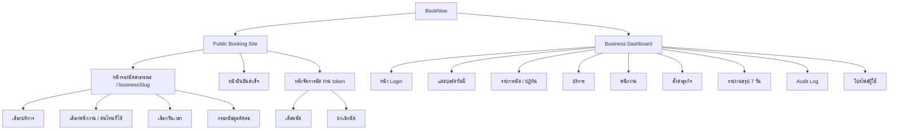

# Web Information Architecture — BookNow

> ตัวอย่างเอกสารสมบูรณ์ (product สมมติ) — ใช้เป็นแม่แบบสำหรับโปรเจกต์อื่น

## Status

| Field | Value |
|---|---|
| Document Status | Approved |
| Owner | UX/UI Designer |
| Reviewer | Product Owner, Tech Lead |
| Last Updated | 2026-01-22 |
| Related | [Design Brief](../00_design_brief/design_brief.md), [Permission Requirements](../../04_requirements/permission_requirements.md) |

---

## 1. Overview

BookNow MVP มี **web surface สองส่วนที่แยกกันชัดเจน**:

1. **Public Booking Site** — ไม่ต้อง login ลูกค้าเข้าผ่านลิงก์/QR ของธุรกิจ
2. **Business Dashboard** — ต้อง login เฉพาะ Business Owner และ Staff ที่สังกัดธุรกิจนั้น

ทั้งสองส่วนเป็นแอปเดียวกัน (single web app) แต่แยก layout/navigation กันคนละชุด เพราะกลุ่มผู้ใช้และเป้าหมายต่างกันมาก (ดู [Design Brief](../00_design_brief/design_brief.md))

## 2. Site Map

## 3. Public Booking Site (ไม่ต้อง Login)

| ลำดับ | หน้า/Section | หน้าที่หลัก |
|---|---|---|
| 1 | หน้าจองนัดสาธารณะ (`/:businessSlug`) | จุดเข้าเดียวสำหรับลูกค้า — ไหลผ่าน step เลือกบริการ → พนักงาน → เวลา → ข้อมูลติดต่อ ในหน้าเดียวกัน |
| 2 | หน้ายืนยันสำเร็จ | แสดงเลขอ้างอิงนัด สรุปรายละเอียด และคำอธิบายว่าจะได้รับ SMS/อีเมลยืนยัน |
| 3 | หน้าจัดการนัด (เข้าผ่าน token ในลิงก์ SMS/อีเมล) | ดูรายละเอียดนัด เลือกเลื่อนหรือยกเลิก (มี branch cutoff time) |

ไม่มีเมนู/navbar แบบเว็บทั่วไปในส่วนนี้ เพราะลูกค้าไม่ได้มาสำรวจเว็บไซต์ — ออกแบบให้เป็น flow เชิงเส้น (linear flow) ไม่ใช่ไซต์ที่มีหลายหน้าให้เดินเล่น

รายละเอียด flow → [Booking Flow](../01_user_flows/booking_flow.md), [Cancellation Flow](../01_user_flows/cancellation_flow.md)
รายละเอียดหน้าจอ → [Screen Spec: Public Booking Page](../04_screen_specs/screen_spec_public_booking_page.md)

## 4. Business Dashboard (ต้อง Login)

Navigation หลักเป็น left sidebar (ใช้งานบนคอมพิวเตอร์เป็นหลักช่วงตั้งค่าร้าน และรองรับมือถือแบบ bottom nav แบบย่อสำหรับเช็คระหว่างวัน)

| เมนู | หน้าที่หลัก | เข้าถึงได้โดย |
|---|---|---|
| แดชบอร์ดวันนี้ | สรุปนัดวันนี้ + สถิติด่วน | Owner (เห็นทุกพนักงาน), Staff (เห็นเฉพาะตัวเอง เว้นแต่มี `view_all_bookings`) |
| รายการนัด / ปฏิทิน | ดูนัดแบบ list หรือปฏิทินตามช่วงวันที่เลือก, mark completed/no-show | Owner (ทุกนัด), Staff (นัดตัวเอง หรือทุกนัดถ้ามี `view_all_bookings`, แก้ไขได้เฉพาะที่มี `manage_all_bookings`) |
| บริการ | เพิ่ม/แก้ไข/ปิดใช้งานบริการ (soft delete) | Owner เท่านั้น |
| พนักงาน | เชิญพนักงาน, กำหนดบริการที่ให้ได้, ตั้งสิทธิ์ `view_all_bookings`/`manage_all_bookings`, ลบพนักงาน | Owner เท่านั้น |
| ตั้งค่าธุรกิจ | ชื่อร้าน, ที่อยู่, เวลาทำการ, วันหยุด, cutoff time, grace period | Owner เท่านั้น |
| รายงานสรุป 7 วัน | no-show rate, cancellation/late-cancellation rate, จำนวนนัดต่อพนักงาน | Owner (แก้ไขไม่ได้ เป็นรายงาน), Staff ที่มี `view_all_bookings` (read-only) |
| Audit Log | ประวัติการเปลี่ยนแปลง booking ทั้งหมด (append-only) | Owner เท่านั้น |
| โปรไฟล์ผู้ใช้ | เปลี่ยนรหัสผ่าน, ข้อมูลติดต่อของตัวเอง | ทุก role (เฉพาะข้อมูลของตัวเอง) |

Role-gating ทั้งหมดในตารางนี้อ้างอิงตรงจาก [Permission Requirements — Permission Matrix](../../04_requirements/permission_requirements.md#permission-matrix) เมนูที่ผู้ใช้ไม่มีสิทธิ์ **ต้องไม่แสดงในรายการเมนูเลย** ไม่ใช่แสดงแบบ disabled/grey-out เพื่อไม่ให้ Staff เข้าใจผิดว่ามีฟีเจอร์นั้นอยู่

รายละเอียดหน้าจอ → [Screen Spec: Owner Dashboard](../04_screen_specs/screen_spec_owner_dashboard.md), [Staff Schedule Flow](../01_user_flows/staff_schedule_flow.md)

## 5. Notes สำหรับทีมที่ Reuse Template นี้

- ถ้าโปรเจกต์จริงมี business หลายสาขา (multi-location) ต้องเพิ่ม location switcher เข้า sidebar ก่อนเมนูอื่น — MVP นี้ไม่ต้องเพราะ scope เป็น single-location (ดู [Product Context](../../00_overview/product_context.md))
- ถ้าเพิ่ม role "Manager" ในอนาคต (ดู [Open Questions ใน Permission Requirements](../../04_requirements/permission_requirements.md#open-questions)) ต้องมาปรับตารางเมนูนี้ให้ตรงสิทธิ์ใหม่ด้วย
