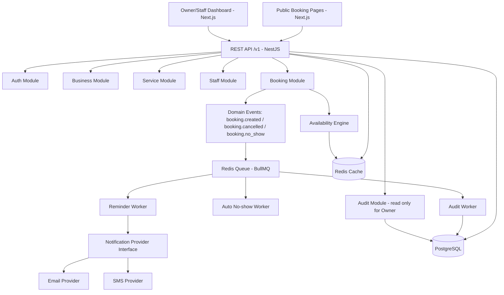
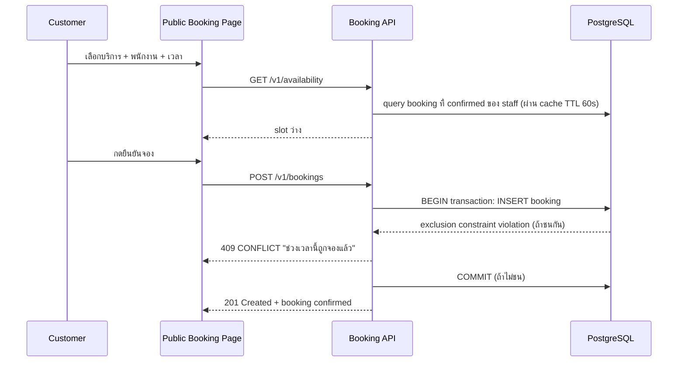
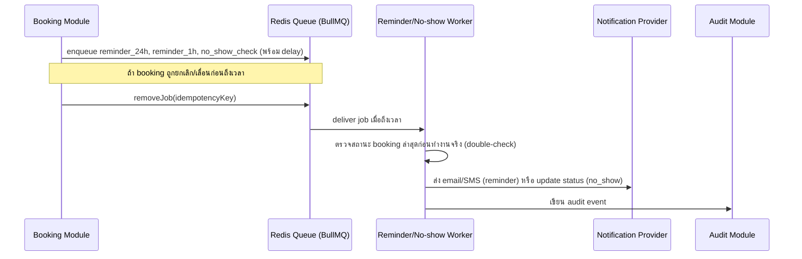

# Backend Architecture — BookNow

> ตัวอย่างเอกสารสมบูรณ์ (product สมมติ) — ใช้เป็นแม่แบบสำหรับโปรเจกต์อื่น

**Product Name:** BookNow
**Product Positioning:** แพลตฟอร์มจองนัดหมายและจัดการตารางงานสำหรับธุรกิจบริการรายเล็ก-กลาง
**Document Type:** Backend Architecture Specification
**Primary Output:** System Architecture, Core Modules, Availability/Double-booking Guarantee, Background Jobs, Caching

## Status

| Field | Value |
|---|---|
| Document Status | Approved |
| Owner | Tech Lead |
| Reviewer | Product Owner, Backend Team |
| Last Updated | 2026-02-03 |
| Related | [Product Context](../../00_overview/product_context.md), [PRD](../../03_product/prd/prd.md), [Functional Requirements](../../04_requirements/functional_requirements.md), [Business Rules](../../04_requirements/business_rules.md), [Permission Requirements](../../04_requirements/permission_requirements.md) |

---

## 0. Executive Summary

Backend ของ BookNow ต้องรับประกัน 2 เรื่องที่กระทบรายได้ของธุรกิจลูกค้าโดยตรง: **ห้ามจองชนกัน** (BR-001) และ **ต้องแจ้งเตือนได้ตรงเวลา** (FR-007) ส่วนขอบเขตอื่นของระบบ (จัดการบริการ พนักงาน แดชบอร์ด) มีความซับซ้อนต่ำและ traffic ต่ำในระยะ MVP (ธุรกิจเดี่ยว 1 สาขา)

จากขอบเขตนี้ เลือกเริ่มต้นด้วย **modular monolith บน NestJS (Node.js/TypeScript)** แทน microservices เต็มรูปแบบ เพราะ:

- MVP มี traffic ต่ำ (ธุรกิจ 1-20 ที่นั่ง/ช่าง) ไม่มีความจำเป็นต้อง scale แยกส่วนตั้งแต่วันแรก
- การันตี "ห้ามจองชนกัน" ทำได้ตรงไปตรงมาที่สุดด้วย **transaction เดียวในฐานข้อมูลเดียว** (ดูข้อ 4) — ถ้าแยก service เร็วเกินไปจะเพิ่มความเสี่ยง distributed transaction โดยไม่จำเป็น
- ทีมเล็กดูแล deploy/debug ง่ายกว่า และยัง refactor แยก service ได้ในอนาคตถ้า module boundary ถูกออกแบบมาดีตั้งแต่แรก

Stack หลักที่เลือก:

| Layer | เลือก | เหตุผล |
|---|---|---|
| Backend Framework | NestJS (Node.js/TypeScript) | modular pattern ชัดเจน เหมาะกับ team เล็กที่ต้องขยาย module ทีละส่วน |
| Database | PostgreSQL + Prisma ORM | ข้อมูล booking/schedule เป็น relational โดยธรรมชาติ (business → service → staff → booking มี foreign key ชัดเจน) การันตี double-booking ต้องพึ่ง DB constraint/transaction ซึ่ง relational DB ทำได้ตรงและเชื่อถือได้กว่า document DB |
| API Style | REST, versioned `/v1` | เข้าใจง่าย เหมาะกับ web client เดียวใน MVP |
| Cache/Queue | Redis | cache availability calculation + queue สำหรับ reminder/no-show job |
| Web | Next.js | หน้าจองสาธารณะต้องเร็วและ SEO-friendly (SSR/SSG) ส่วน dashboard ใช้ SPA-like client rendering ในแอปเดียวกัน — ดู [Web Architecture](../web/web_architecture.md) |
| Notification | Pluggable provider interface (email + SMS) | หลีกเลี่ยง vendor lock-in เพราะ SMS provider/ต้นทุนต่างกันมากในแต่ละประเทศ (ดู PRD Open Questions) |

---

## 1. Purpose

เอกสารนี้ใช้เพื่อ:

- กำหนด backend architecture ของ BookNow MVP และแนวทาง evolve ไป production/scale
- ระบุ module boundary สำหรับทีม backend
- อธิบายวิธีการันตี BR-001 (ห้ามจองชนกัน) แบบ end-to-end ตั้งแต่ API ถึง database
- อธิบาย background job strategy สำหรับ reminder (FR-007) และ auto no-show (BR-003)
- อธิบาย caching strategy ที่ไม่ขัดกับ BR-005 (ห้าม cache availability เกิน 60 วินาที)

---

## 2. Business Value

| Architecture Area | Business Value |
|---|---|
| Modular monolith | ส่ง MVP เร็ว ทีมเล็กดูแลง่าย ยังแยก service ได้ในอนาคต |
| DB-level booking constraint | การันตีไม่มี double booking แม้มี concurrent request — จุดขายหลักของ product |
| Reliable background jobs | reminder ตรงเวลาลด no-show ได้จริงตาม success metric ของ PRD (ลด no-show 20%+) |
| Pluggable notification provider | เปลี่ยน SMS provider ตามตลาด/ต้นทุนได้โดยไม่แก้ core domain logic |
| Append-only audit module | รองรับ BR-007 และสร้างความน่าเชื่อถือให้ Owner ตรวจสอบย้อนหลังได้ |
| Caching ที่มี TTL สั้น | dashboard/availability เร็วขึ้นโดยไม่ละเมิด BR-005 |

---

## 3. Architecture Principles

### 3.1 Modular Monolith ก่อน ไม่ใช่ Microservices ตั้งแต่วันแรก

MVP เป็น modular monolith บน NestJS ที่แยก module ชัดเจนในโค้ดเดียว deploy เป็น process เดียว (+ worker process แยกสำหรับ background job) เมื่อ traffic โตขึ้น (multi-location ใน Phase 3) จึงพิจารณาแยก module ที่มี load หรือ lifecycle ต่างจาก core booking flow ออกเป็น service แยก เช่น Notification

### 3.2 Booking Integrity ต้องพึ่ง Database ไม่ใช่ Application Logic

BR-001 ระบุชัดว่าต้องกันชนที่ระดับ database ไม่ใช่แค่ app logic เพราะ race condition เกิดได้จริงเมื่อลูกค้า 2 คนกดจองพร้อมกัน (ดู FR-004 acceptance criteria) ดังนั้นทุก path ที่สร้าง/เลื่อนนัดต้องผ่าน transaction ที่มี DB constraint เป็นตัวตัดสินสุดท้าย

### 3.3 Fail Closed สำหรับ Permission

ถ้า permission check ไม่ผ่านหรือระบบตรวจสอบไม่ได้ (เช่น token ของ customer ตรวจสอบไม่ได้) ต้องปฏิเสธ ไม่ใช่อนุญาตไว้ก่อน (สอดคล้อง [Permission Requirements](../../04_requirements/permission_requirements.md) Core Principle)

### 3.4 Background Job สำหรับทุกอย่างที่ต้อง "เกิดขึ้นเองตามเวลา"

Reminder (FR-007) และ auto no-show (BR-003) ต้องไม่พึ่งการที่ผู้ใช้เปิดหน้าเว็บ ต้องเป็น background job ที่รันเองตามเวลา และต้อง idempotent (รันซ้ำได้โดยไม่ส่งซ้ำ/mark ซ้ำ)

### 3.5 Audit ทุก Booking Event และทุกการเปลี่ยนสิทธิ์

ทุก action ที่เปลี่ยนสถานะ booking หรือเปลี่ยนสิทธิ์ staff ต้องเขียน audit log แบบ append-only (BR-007, PERM-005)

---

## 4. Core Modules

| Module | Responsibility | Future Service Candidate |
|---|---|---|
| Auth | login (email+password/magic link) สำหรับ Owner/Staff, ออก JWT access+refresh, ตรวจสอบ/ออก customer booking token | Maybe |
| Business | business profile, business hours, business-level settings (cutoff time, grace period) | No |
| Service | service catalog (name, duration, price), soft delete (`isActive`) | No |
| Staff | staff profile, staff-service assignment, permission flags (`view_all_bookings`, `manage_all_bookings`) | No |
| Booking | สร้าง/เลื่อน/ยกเลิก/mark complete-no_show, เป็นเจ้าของ transaction ที่การันตี BR-001 | Core domain — ไม่แยก |
| Availability Engine | คำนวณช่วงเวลาว่างจาก business hours + booking ที่มีอยู่ + service duration (FR-005, BR-005) | No — ต้องอยู่ใกล้ Booking module เพราะต้อง consistency สูง |
| Notification | ส่ง reminder/confirmation ผ่าน provider interface (email/SMS) | Yes — แยกก่อนสุดถ้า traffic โต |
| Audit | บันทึก audit event แบบ append-only, endpoint อ่านสำหรับ Owner | Maybe |

โครงสร้างโค้ดใน NestJS: แต่ละ module ข้างต้นคือ 1 NestJS module (`AuthModule`, `BusinessModule`, `ServiceModule`, `StaffModule`, `BookingModule`, `AvailabilityModule`, `NotificationModule`, `AuditModule`) แยก controller/service/repository ของตัวเอง เรียกข้าม module ผ่าน service injection เท่านั้น ห้าม query ตาราง module อื่นตรงจาก repository ของอีก module เพื่อคง boundary ไว้สำหรับแยก service ในอนาคต

### 4.1 High-level Architecture Diagram



---

## 5. Booking Integrity: ป้องกัน Double Booking แบบ End-to-End

การการันตี BR-001 ต้องทำงานเป็นชั้น (defense in depth) — แต่ชั้นที่ "ตัดสินจริง" คือ database:

1. **Client-side (Next.js booking page):** หลังลูกค้าเลือกเวลา ระบบ disable slot ที่แสดงไปแล้วทันทีใน UI ระหว่างรอ confirm (ลด race แต่ไม่ใช่การการันตี)
2. **Availability Engine (API):** ก่อนแสดง slot ว่างให้ลูกค้าเลือก คำนวณจาก business hours + booking ที่ status `confirmed` ของ staff คนนั้น ผลลัพธ์ cache ใน Redis ไม่เกิน 60 วินาที (BR-005)
3. **Booking creation transaction (ตัวจริง):** เมื่อลูกค้ากดยืนยัน API เปิด PostgreSQL transaction เดียว ที่ทำ 2 อย่างในธุรกรรมเดียว:
   - `INSERT` แถว `bookings` ใหม่
   - พึ่ง **exclusion constraint** ระดับ database (`EXCLUDE USING gist` บน `(staff_id, time_range)` เมื่อ `status = 'confirmed'`) ที่ปฏิเสธการ insert ถ้าทับซ้อนกับ booking ที่ active ของ staff คนเดียวกัน (รายละเอียด schema → [Database Schema](../database/database_schema.md) หัวข้อ `bookings`)
   - ถ้า constraint violation เกิดขึ้น (error code `23P01`) API จับ error แล้วตอบ `409 CONFLICT` ให้ frontend แสดง "ช่วงเวลานี้ถูกจองแล้ว" (ตรงกับ FR-004 acceptance criteria)
4. **Reschedule ก็ต้องผ่าน transaction เดียวกัน:** การเลื่อนนัดคือ update `start_time`/`end_time` ของ booking เดิม ซึ่งต้องผ่าน constraint เดียวกันนี้ ไม่มี path ลัดที่ bypass ได้



ทำไมเลือก PostgreSQL exclusion constraint แทน application-level lock: exclusion constraint ทำงานที่ database engine เอง จึงถูกต้องแม้มี 2 request มาถึงพร้อมกันในระดับ millisecond (race condition จริงตามที่ FR-004 ระบุไว้) ในขณะที่ app-level lock (เช่น mutex ใน process เดียว) ใช้ไม่ได้ถ้า deploy หลาย instance ในอนาคต

---

## 6. Background Job Strategy

ใช้ Redis + BullMQ เป็น job queue รันบน worker process แยกจาก API process

| Job | Trigger | Timing | Idempotency Key |
|---|---|---|---|
| Reminder 24h | booking status = `confirmed` | scheduled ตอนสร้าง booking (ล่วงหน้า 24 ชม. ก่อนนัด) | `booking_id + '24h'` |
| Reminder 1h | booking status = `confirmed` | scheduled ตอนสร้าง booking (ล่วงหน้า 1 ชม. ก่อนนัด) | `booking_id + '1h'` |
| Auto no-show | ผ่านเวลานัด + grace period (default 15 นาที, ปรับได้ต่อธุรกิจ) และยังไม่ mark `completed` | cron ตรวจทุก 1 นาที (reconciliation) + job ที่ schedule ไว้ตอนสร้าง booking | `booking_id + 'no_show_check'` |

หลักการสำคัญ:

- **ต้องยกเลิก job ทันทีเมื่อ booking ถูกยกเลิก/เลื่อน** (BR-008): เมื่อ `Booking.cancel()`/`Booking.reschedule()` ทำงานสำเร็จ ระบบต้องเรียก `queue.removeJob(idempotencyKey)` ของ reminder job เดิมทันทีในธุรกรรมเดียวกัน (หรือ worker ตรวจสอบสถานะ booking ล่าสุดก่อนส่งจริงเสมอ เป็น double-check ชั้นที่ 2)
- **Auto no-show ต้องมี reconciliation job แยก** (cron ทุก 1 นาที สแกน booking ที่ `status = confirmed` และ `end_time + grace_period < now()`) เพื่อไม่พึ่งแค่ scheduled job เดี่ยว ในกรณี worker ล่มระหว่าง job ที่ schedule ไว้หาย
- **Retry:** ส่ง notification fail ให้ retry แบบ exponential backoff สูงสุด 3 ครั้ง ถ้ายัง fail ให้บันทึก `notifications.status = failed` และไม่ block booking flow อื่น
- **Grace period และ cutoff time เป็นค่า config ต่อธุรกิจ** อ่านจาก `businesses.cancellation_cutoff_minutes` และ `businesses.no_show_grace_minutes` (ดู [Database Schema](../database/database_schema.md))



---

## 7. Caching Strategy

| Data | Cache | TTL | เหตุผล |
|---|---:|---:|---|
| Availability slot ต่อ staff/service/วัน | Yes | **สูงสุด 60 วินาที** | BR-005 บังคับห้าม cache เกิน 60s เพื่อลดโอกาส double booking จากข้อมูลเก่า |
| Dashboard สรุปนัดวันนี้ (Owner/Staff) | Yes | 30 วินาที | ลด load บน DB โดยไม่กระทบความแม่นยำมากนัก (ข้อมูลสรุป ไม่ใช่ transactional path) |
| Business profile/business hours | Yes | 5 นาที | เปลี่ยนไม่บ่อย invalidate ทันทีเมื่อ Owner แก้ไข |
| Service catalog (สำหรับหน้าจองสาธารณะ) | Yes | 5 นาที | invalidate ทันทีเมื่อ Owner เพิ่ม/ปิดบริการ |
| Customer booking token validation | No | - | ต้องตรวจสอบสถานะ token ล่าสุดเสมอ (อาจถูก revoke/expire) |

Cache invalidation ต้องเกิดทันทีเมื่อ: booking ถูกสร้าง/เลื่อน/ยกเลิก, business hours เปลี่ยน, service ถูกเพิ่ม/soft-delete, staff-service assignment เปลี่ยน

Cache key ต้องรวม scope ที่จำเป็นเพื่อไม่ให้ข้อมูลข้าม business/staff กัน เช่น:

```text
availability:v1:business:{businessId}:staff:{staffId}:service:{serviceId}:date:{date}
```

---

## 8. Auth Architecture

| Actor | Method | Token |
|---|---|---|
| Business Owner / Staff | Email+password หรือ magic link | JWT access token (15 นาที) + refresh token (30 วัน, rotate on use) |
| Customer | ไม่มี password — เข้าถึงผ่านลิงก์ที่มี signed token ผูกกับ booking เดียว | Single-purpose signed token (JWT ลงชื่อด้วย secret, ไม่ใช่ session ทั่วไป) หมดอายุ 30 วันหลัง booking เสร็จสิ้น/ถูกยกเลิก (PERM-003) |

Customer token ไม่ใช่ user session — เป็น capability token ที่ผูกกับ `booking_id` เดียวเท่านั้น ตรวจสอบทุกครั้งที่ใช้งานว่า token ยังไม่ expired และ `booking_id` ใน token ตรงกับ resource ที่ request (ป้องกันการเดา/แก้ booking ID ใน URL เพื่อดูนัดคนอื่น — สอดคล้อง Permission Requirements "Explicitly Not Allowed")

รายละเอียด endpoint และ error code → [API Spec](../api/api_spec.md)

---

## 9. Security & Privacy Considerations

- ทุก endpoint ที่แก้ไข booking ต้องผ่าน permission guard ตาม PERM-001 ก่อนเข้า business logic (fail closed)
- Customer token ต้อง sign ด้วย secret ที่ต่างจาก JWT ของ Owner/Staff เพื่อจำกัด blast radius ถ้า secret รั่ว
- Rate limit หน้าจองสาธารณะและ endpoint ที่ไม่ auth (ป้องกัน scraping/spam booking)
- Notification (BR-009) ต้องส่งข้อมูลเท่าที่จำเป็น — ห้าม inject ข้อมูลลูกค้า/พนักงานคนอื่นในเนื้อหาข้อความ
- Audit log ต้อง immutable ที่ระดับ repository (ไม่มี `update`/`delete` method ให้เรียกเลย ไม่ใช่แค่ไม่มี endpoint)

---

## 10. Failure Scenarios

| Failure | Impact | Handling |
|---|---|---|
| Redis ล่ม | availability cache/queue หยุดทำงาน | fallback query availability ตรงจาก PostgreSQL (ช้าลงแต่ยังถูกต้อง), pause reminder job, alert ops |
| Notification provider ล่ม | reminder ส่งไม่ได้ | retry exponential backoff, mark `notifications.status = failed`, ไม่ block booking flow |
| Worker process ล่มระหว่างมี job ค้าง | reminder/no-show อาจไม่เกิด | reconciliation cron (ข้อ 6) ตรวจ booking ที่เลย grace period ทุก 1 นาทีเป็น safety net |
| DB connection saturation | booking creation ช้า/timeout | connection pool tuning, retry ที่ client พร้อม idempotency, ไม่ retry เกิน transaction ที่มี side effect |
| Race condition สองลูกค้าจองพร้อมกัน | คนหนึ่งควรถูกปฏิเสธ | exclusion constraint (ข้อ 5) ปฏิเสธคนที่ commit ทีหลังเสมอ |

---

## 11. Product and Architecture Decisions

| Decision | Choice | Reasoning |
|---|---|---|
| MVP architecture | Modular monolith | เร็วต่อการส่งมอบ, ทีมเล็กดูแลง่าย, ยัง evolve ได้ |
| Database | PostgreSQL + Prisma | relational fit กับ booking/scheduling domain, การันตี constraint ได้จริง |
| Booking integrity | DB exclusion constraint ใน transaction | เป็นชั้นเดียวที่ตัดสินได้ถูกต้องภายใต้ concurrency |
| Background job | Redis + BullMQ, worker process แยก | reliable, retry ได้, ไม่ block API request |
| Notification | Provider interface (email + SMS) | เปลี่ยน vendor ได้โดยไม่แก้ domain logic |
| Availability cache | TTL สูงสุด 60 วินาที | ตาม BR-005 ตรงตัว |

---

## 12. Open Questions

- ควรย้าย Availability Engine ไปเป็น service แยกเมื่อไหร่ ถ้าธุรกิจในระบบเพิ่มจำนวนมากและ query pattern ซับซ้อนขึ้น (multi-location ใน Phase 3)
- ต้องมี dedicated queue metrics/alerting ตั้งแต่ MVP หรือรอ pilot ก่อน (ดู PRD Open Questions เรื่อง SMS provider ที่จะกระทบ cost ของ reminder job ด้วย)
- Rate limit เฉพาะ IP พอไหมสำหรับหน้าจองสาธารณะ หรือต้องผูกกับ business/service เพิ่มด้วย

---

## 13. Linked Docs

- [Database Schema](../database/database_schema.md)
- [API Spec](../api/api_spec.md)
- [Web Architecture](../web/web_architecture.md)
- [Product Context](../../00_overview/product_context.md)
- [PRD](../../03_product/prd/prd.md)
- [Functional Requirements](../../04_requirements/functional_requirements.md)
- [Business Rules](../../04_requirements/business_rules.md)
- [Permission Requirements](../../04_requirements/permission_requirements.md)
