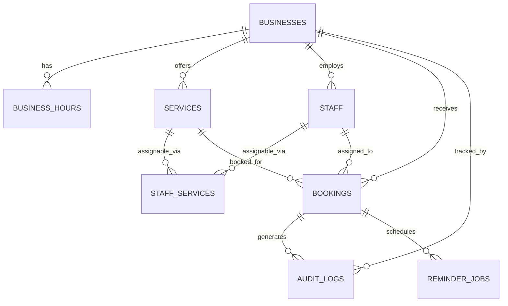

# Database Schema — BookNow

> ตัวอย่างเอกสารสมบูรณ์ (product สมมติ) — ใช้เป็นแม่แบบสำหรับโปรเจกต์อื่น

**Product Name:** BookNow
**Database:** PostgreSQL (ผ่าน Prisma ORM)
**Document Type:** Database Schema Specification
**Primary Output:** ER Diagram, Tables, Constraints, Indexes, Soft Delete Pattern

## Status

| Field | Value |
|---|---|
| Document Status | Approved |
| Owner | Tech Lead |
| Reviewer | Backend Team, Product Owner |
| Last Updated | 2026-02-04 |
| Related | [Backend Architecture](../backend_architecture/backend_architecture.md), [Business Rules](../../04_requirements/business_rules.md), [Functional Requirements](../../04_requirements/functional_requirements.md) |

---

## 0. Executive Summary

BookNow ใช้ **PostgreSQL** เป็นฐานข้อมูลหลัก เพราะโดเมนของ product คือ "การจองเวลา" ซึ่งมีความสัมพันธ์แบบ relational ชัดเจน (business → service → staff → booking) และที่สำคัญที่สุดคือ ต้องการันตี **ห้ามจองชนกัน** (BR-001) ซึ่งทำได้ตรงและน่าเชื่อถือที่สุดด้วย database-level constraint + transaction ของ relational database — เป็นสิ่งที่ document database ทำได้ยากหรือต้องพึ่ง application-level lock ที่ไม่การันตีภายใต้ concurrency จริง

หลักการออกแบบหลัก:

- ใช้ **normalized relational schema** ไม่ embed ข้อมูลข้าม entity เพราะข้อมูลทุกตัว (service, staff, booking) ถูก query แยกกันบ่อยและต้องรักษา referential integrity
- ใช้ **PostgreSQL exclusion constraint** (`EXCLUDE USING gist`) บนตาราง `bookings` เพื่อป้องกัน overlapping booking ต่อ staff คนเดียวกัน — เป็นแกนหลักของเอกสารนี้
- ใช้ **soft delete** (`is_active` / `deleted_at`) เฉพาะ `services` และ `staff` ตาม BR-006 ไม่ลบจริงเพราะ booking เก่ายังต้องอ้างอิงชื่อ/ราคาได้
- `audit_logs` เป็น **append-only** ตาม BR-007 — ไม่มี `UPDATE`/`DELETE` privilege ให้ application role เลยที่ระดับ DB

---

## 1. Purpose

เอกสารนี้ใช้เพื่อ:

- กำหนด PostgreSQL schema ของ BookNow MVP (tables, columns, types, foreign keys)
- ระบุ constraint ที่การันตี BR-001 แบบ database-level
- ระบุ index สำหรับ query ที่ใช้บ่อยที่สุด (นัดวันนี้ต่อธุรกิจ/ต่อพนักงาน)
- กำหนด soft-delete pattern สำหรับ `services`/`staff`
- เป็นฐานให้ทีม backend สร้าง Prisma schema และ migration ได้ทันที

---

## 2. Business Value

| Database Decision | Business Value |
|---|---|
| PostgreSQL relational model | data integrity สูง เหมาะกับ booking domain ที่มี foreign key ชัดเจน |
| Exclusion constraint บน `bookings` | การันตี BR-001 ที่ระดับ database ไม่พึ่ง application logic เพียงอย่างเดียว |
| Index ตาม `business_id`/`staff_id`/`start_time` | dashboard "นัดวันนี้" เร็ว แม้ข้อมูลโตขึ้นตามจำนวนธุรกิจ |
| Soft delete `services`/`staff` | ประวัติ booking เก่ายังถูกต้อง แม้บริการ/พนักงานถูกปิดใช้งานแล้ว |
| Audit log append-only | สร้างความน่าเชื่อถือ ตรวจสอบย้อนหลังได้ ไม่มีใครแก้ประวัติได้ |

---

## 3. Entity Relationship Diagram



หมายเหตุ: `businesses` เป็น root entity ของทุก table หลัก — ทุก query ต้อง scope ด้วย `business_id` เพื่อป้องกันข้อมูลข้ามธุรกิจ (แม้ MVP รองรับ 1 ธุรกิจต่อ Owner แต่ schema ออกแบบให้รองรับหลายธุรกิจต่อ instance ของระบบได้)

---

## 4. Table Overview

| Table | Purpose | Soft Delete |
|---|---|---:|
| `businesses` | ธุรกิจ/ร้าน 1 รายการ | No (rare, ทำผ่าน process แยก) |
| `business_hours` | เวลาทำการต่อวันในสัปดาห์ | No |
| `services` | รายการบริการที่ธุรกิจเปิดขาย | Yes (`is_active`) |
| `staff` | พนักงาน/ช่างที่ให้บริการ | Yes (`is_active`) |
| `staff_services` | mapping พนักงาน ↔ บริการที่ทำได้ | No (hard delete ได้ เป็นแค่ mapping) |
| `bookings` | นัดหมาย 1 รายการ | No (ใช้ `status` แทน) |
| `audit_logs` | บันทึกการเปลี่ยนแปลง booking/permission แบบ append-only | No (ห้าม delete โดยหลักการ) |
| `reminder_jobs` | สถานะ background job แจ้งเตือนต่อ booking | No |
| `notifications` | ประวัติการส่ง email/SMS จริง | No |

---

## 5. Core Tables

### 5.1 `businesses`

```sql
CREATE TABLE businesses (
  id                          UUID PRIMARY KEY DEFAULT gen_random_uuid(),
  owner_user_id               UUID NOT NULL REFERENCES users(id),
  name                        VARCHAR(255) NOT NULL,
  address                     TEXT,
  timezone                    VARCHAR(64) NOT NULL DEFAULT 'Asia/Bangkok',
  cancellation_cutoff_minutes INTEGER NOT NULL DEFAULT 120,   -- BR-002 ค่า default 2 ชม. ปรับได้ต่อธุรกิจ
  no_show_grace_minutes       INTEGER NOT NULL DEFAULT 15,    -- BR-003 ค่า default 15 นาที ปรับได้ต่อธุรกิจ
  created_at                  TIMESTAMPTZ NOT NULL DEFAULT now(),
  updated_at                  TIMESTAMPTZ NOT NULL DEFAULT now()
);
```

`cancellation_cutoff_minutes` และ `no_show_grace_minutes` ทำให้ BR-002/BR-003 เป็นค่า config ต่อธุรกิจตามที่ Business Rules ระบุไว้ ไม่ hardcode ใน application

#### Indexes

| Index | Type | Reason |
|---|---|---|
| `owner_user_id` | btree | หา business ของ Owner คนหนึ่ง |

---

### 5.2 `business_hours`

```sql
CREATE TABLE business_hours (
  id           UUID PRIMARY KEY DEFAULT gen_random_uuid(),
  business_id  UUID NOT NULL REFERENCES businesses(id) ON DELETE CASCADE,
  day_of_week  SMALLINT NOT NULL CHECK (day_of_week BETWEEN 0 AND 6), -- 0 = Sunday
  open_time    TIME NOT NULL,
  close_time   TIME NOT NULL,
  is_closed    BOOLEAN NOT NULL DEFAULT false,   -- true = ปิดวันนั้นทั้งวัน (FR-005 "ร้านปิดวันอาทิตย์")
  created_at   TIMESTAMPTZ NOT NULL DEFAULT now(),
  updated_at   TIMESTAMPTZ NOT NULL DEFAULT now(),
  UNIQUE (business_id, day_of_week)
);
```

#### Indexes

| Index | Type | Reason |
|---|---|---|
| `(business_id, day_of_week)` | unique | 1 ธุรกิจมีได้ 1 record ต่อวันในสัปดาห์ |

---

### 5.3 `services`

```sql
CREATE TABLE services (
  id               UUID PRIMARY KEY DEFAULT gen_random_uuid(),
  business_id      UUID NOT NULL REFERENCES businesses(id) ON DELETE CASCADE,
  name             VARCHAR(255) NOT NULL,
  duration_minutes INTEGER NOT NULL CHECK (duration_minutes > 0),
  price            NUMERIC(12, 2) NOT NULL CHECK (price >= 0),
  is_active        BOOLEAN NOT NULL DEFAULT true,   -- BR-006 soft delete
  created_at       TIMESTAMPTZ NOT NULL DEFAULT now(),
  updated_at       TIMESTAMPTZ NOT NULL DEFAULT now()
);
```

#### Indexes

| Index | Type | Reason |
|---|---|---|
| `(business_id, is_active)` | btree | หน้าจองสาธารณะดึงเฉพาะบริการที่ active |

#### Soft Delete Rule

"ลบ" บริการ = `UPDATE services SET is_active = false WHERE id = ...` เท่านั้น (FR-002, BR-006) — ห้าม `DELETE` เพราะ `bookings.service_id` อ้างอิงอยู่ Repository layer ต้อง filter `is_active = true` เป็น default สำหรับหน้าจองใหม่ แต่ booking เก่ายัง join ไปอ่านชื่อ/ราคาบริการที่ปิดไปแล้วได้ตามปกติ

---

### 5.4 `staff`

```sql
CREATE TABLE staff (
  id                   UUID PRIMARY KEY DEFAULT gen_random_uuid(),
  business_id          UUID NOT NULL REFERENCES businesses(id) ON DELETE CASCADE,
  user_id              UUID NOT NULL REFERENCES users(id),
  display_name         VARCHAR(255) NOT NULL,
  is_active            BOOLEAN NOT NULL DEFAULT true,    -- BR-006 soft delete
  view_all_bookings    BOOLEAN NOT NULL DEFAULT false,   -- PERM-002
  manage_all_bookings  BOOLEAN NOT NULL DEFAULT false,   -- PERM-002
  created_at           TIMESTAMPTZ NOT NULL DEFAULT now(),
  updated_at           TIMESTAMPTZ NOT NULL DEFAULT now(),
  UNIQUE (business_id, user_id)
);
```

#### Indexes

| Index | Type | Reason |
|---|---|---|
| `(business_id, is_active)` | btree | list พนักงาน active ของธุรกิจ |
| `(business_id, user_id)` | unique | 1 user เป็นพนักงานได้ครั้งเดียวต่อธุรกิจ |

#### Soft Delete & Revoke Rule

"ลบ" พนักงาน = `is_active = false` (BR-006) แต่ PERM-004 ต้องการมากกว่านั้น — เมื่อ Owner ลบพนักงาน ต้อง revoke session/refresh token ของ user คนนั้นทันทีที่ระดับ Auth module (ไม่ใช่แค่ตั้ง flag ในตารางนี้) เพื่อไม่ให้ token เดิมยังใช้เรียก API ได้

---

### 5.5 `staff_services`

Mapping ว่าพนักงานคนไหนให้บริการอะไรได้ (FR-003)

```sql
CREATE TABLE staff_services (
  staff_id    UUID NOT NULL REFERENCES staff(id) ON DELETE CASCADE,
  service_id  UUID NOT NULL REFERENCES services(id) ON DELETE CASCADE,
  created_at  TIMESTAMPTZ NOT NULL DEFAULT now(),
  PRIMARY KEY (staff_id, service_id)
);
```

#### Indexes

| Index | Type | Reason |
|---|---|---|
| `(service_id, staff_id)` | btree (secondary, ผ่าน composite PK ด้านกลับ) | หน้าจอง: "บริการนี้ใครทำได้บ้าง" |

---

### 5.6 `bookings` — ตารางที่สำคัญที่สุด

```sql
CREATE EXTENSION IF NOT EXISTS btree_gist;

CREATE TYPE booking_status AS ENUM (
  'confirmed',
  'cancelled_by_customer',
  'late_cancellation',
  'no_show',
  'completed'
);

CREATE TABLE bookings (
  id               UUID PRIMARY KEY DEFAULT gen_random_uuid(),
  business_id      UUID NOT NULL REFERENCES businesses(id) ON DELETE CASCADE,
  service_id       UUID NOT NULL REFERENCES services(id),
  staff_id         UUID NOT NULL REFERENCES staff(id),
  customer_name    VARCHAR(255) NOT NULL,
  customer_phone   VARCHAR(32) NOT NULL,
  customer_email   VARCHAR(255),
  start_time       TIMESTAMPTZ NOT NULL,
  end_time         TIMESTAMPTZ NOT NULL CHECK (end_time > start_time),
  status           booking_status NOT NULL DEFAULT 'confirmed',
  customer_token   VARCHAR(512) NOT NULL,   -- signed token (hash เก็บจริง ไม่เก็บ raw) ผูก booking นี้ (PERM-003)
  cancelled_at     TIMESTAMPTZ,
  completed_at     TIMESTAMPTZ,
  created_at       TIMESTAMPTZ NOT NULL DEFAULT now(),
  updated_at       TIMESTAMPTZ NOT NULL DEFAULT now(),

  -- BR-001: ห้ามจองชนกันของ staff คนเดียวกัน เฉพาะ booking ที่ยัง active (confirmed)
  -- ใช้ exclusion constraint ระดับ database กันชนแม้มี concurrent insert
  CONSTRAINT no_overlapping_confirmed_booking
    EXCLUDE USING gist (
      staff_id WITH =,
      tstzrange(start_time, end_time) WITH &&
    ) WHERE (status = 'confirmed')
);
```

#### เจาะรายละเอียด Constraint ที่การันตี BR-001

```sql
CONSTRAINT no_overlapping_confirmed_booking
  EXCLUDE USING gist (
    staff_id WITH =,
    tstzrange(start_time, end_time) WITH &&
  ) WHERE (status = 'confirmed')
```

- `EXCLUDE USING gist` คือ PostgreSQL exclusion constraint — ปฏิเสธการ `INSERT`/`UPDATE` ใดๆ ที่ทำให้มี 2 แถวที่ `staff_id` เท่ากัน **และ** ช่วงเวลา (`tstzrange`) ทับซ้อนกัน (`&&`)
- เงื่อนไข `WHERE (status = 'confirmed')` (partial exclusion constraint) ทำให้ booking ที่ถูกยกเลิก/no-show/completed แล้ว **ไม่ถูกนับ** เป็นการชนกันอีก — staff คนเดิมจองเวลาเดิมซ้ำได้ถ้า booking เก่าถูกยกเลิกไปแล้ว
- ต้องเปิด extension `btree_gist` ก่อน เพราะ `staff_id` เป็น UUID (equality type) ที่ผสมกับ range type ใน exclusion constraint เดียวกัน
- เมื่อเกิด violation, PostgreSQL คืน error code `23P01` (`exclusion_violation`) — application (Booking module) จับ error code นี้แล้วแปลงเป็น HTTP `409 CONFLICT` (ดู [Backend Architecture](../backend_architecture/backend_architecture.md) หัวข้อ 5 และ [API Spec](../api/api_spec.md))

#### Indexes

| Index | Type | Reason |
|---|---|---|
| `(business_id, start_time)` | btree | Dashboard "นัดวันนี้ทั้งร้าน" ของ Owner (FR-009) |
| `(staff_id, start_time)` | btree | Dashboard "นัดวันนี้ของฉัน" ของ Staff (FR-009) และ availability lookup |
| `(status, end_time)` | btree | Background job สแกนหา booking ที่เลย grace period เพื่อ mark auto no-show (BR-003) |
| `no_overlapping_confirmed_booking` | GiST (exclusion) | การันตี BR-001 |

ตัวอย่าง query "นัดวันนี้ของธุรกิจ" ที่ index ข้อ 1 รองรับ:

```sql
SELECT * FROM bookings
WHERE business_id = $1
  AND start_time >= $2   -- ต้นวันนี้ (ตาม timezone ของธุรกิจ)
  AND start_time <  $3   -- ต้นวันถัดไป
  AND status = 'confirmed'
ORDER BY start_time ASC;
```

ตัวอย่าง query ที่ background job auto no-show ใช้ (BR-003):

```sql
SELECT * FROM bookings
WHERE status = 'confirmed'
  AND end_time < now() - (
    SELECT (no_show_grace_minutes || ' minutes')::interval
    FROM businesses WHERE id = bookings.business_id
  );
```

---

### 5.7 `audit_logs`

```sql
CREATE TABLE audit_logs (
  id           UUID PRIMARY KEY DEFAULT gen_random_uuid(),
  business_id  UUID NOT NULL REFERENCES businesses(id) ON DELETE CASCADE,
  booking_id   UUID REFERENCES bookings(id),
  actor_type   VARCHAR(16) NOT NULL,   -- 'owner' | 'staff' | 'customer' | 'system'
  actor_id     UUID,                    -- user_id ของ owner/staff, NULL ถ้า actor_type = 'customer'/'system'
  action       VARCHAR(64) NOT NULL,    -- เช่น 'booking.created', 'booking.cancelled', 'staff.permission_changed'
  before_state JSONB,
  after_state  JSONB,
  created_at   TIMESTAMPTZ NOT NULL DEFAULT now()
);
```

#### Indexes

| Index | Type | Reason |
|---|---|---|
| `(business_id, created_at DESC)` | btree | Owner ดู audit log ทั้งร้านเรียงเวลาล่าสุด |
| `(booking_id, created_at DESC)` | btree | ดูประวัติของ booking รายการเดียว |

#### Append-only Enforcement (BR-007)

ไม่พึ่งแค่ "ไม่มี endpoint" — ต้อง enforce ที่หลายชั้น:

1. Repository layer ของ `AuditLog` มีเฉพาะ method `create()` ไม่มี `update()`/`delete()` ให้เรียกเลยในโค้ด
2. Database-level: application's DB role ควร `REVOKE UPDATE, DELETE ON audit_logs FROM app_role;` ให้เหลือแค่ `INSERT`, `SELECT`
3. ถ้าต้องแก้ไขข้อมูลผิดพลาด ให้ insert แถวใหม่ที่มี `action = '<original_action>.corrected'` อ้างอิง `booking_id` เดียวกัน แทนการแก้แถวเดิม (ตรงตาม Business Rules)

---

### 5.8 `reminder_jobs`

ติดตามสถานะ background job ต่อ booking (ไม่ใช่ประวัติการส่งจริง — ดู `notifications` แยก)

```sql
CREATE TYPE reminder_job_type AS ENUM ('reminder_24h', 'reminder_1h', 'no_show_check');
CREATE TYPE reminder_job_status AS ENUM ('scheduled', 'sent', 'skipped', 'failed');

CREATE TABLE reminder_jobs (
  id           UUID PRIMARY KEY DEFAULT gen_random_uuid(),
  booking_id   UUID NOT NULL REFERENCES bookings(id) ON DELETE CASCADE,
  job_type     reminder_job_type NOT NULL,
  status       reminder_job_status NOT NULL DEFAULT 'scheduled',
  scheduled_at TIMESTAMPTZ NOT NULL,
  processed_at TIMESTAMPTZ,
  created_at   TIMESTAMPTZ NOT NULL DEFAULT now(),
  UNIQUE (booking_id, job_type)   -- idempotency: 1 job type ต่อ booking ได้ครั้งเดียว
);
```

#### Indexes

| Index | Type | Reason |
|---|---|---|
| `(status, scheduled_at)` | btree | worker query job ที่ถึงเวลาต้องทำ |
| `(booking_id, job_type)` | unique | ป้องกัน enqueue ซ้ำ (idempotency key ตรงกับ [Backend Architecture](../backend_architecture/backend_architecture.md) หัวข้อ 6) |

`UNIQUE (booking_id, job_type)` คือกลไก idempotency ระดับ DB ที่ทำให้ enqueue ซ้ำไม่สร้าง job ซ้ำ (worker ใช้ `ON CONFLICT DO NOTHING`)

---

### 5.9 `notifications`

ประวัติการส่งข้อความจริง (สำหรับ debug/support และแสดงสถานะการส่ง)

```sql
CREATE TYPE notification_channel AS ENUM ('email', 'sms');
CREATE TYPE notification_status AS ENUM ('queued', 'sent', 'delivered', 'failed');

CREATE TABLE notifications (
  id               UUID PRIMARY KEY DEFAULT gen_random_uuid(),
  booking_id       UUID NOT NULL REFERENCES bookings(id) ON DELETE CASCADE,
  channel          notification_channel NOT NULL,
  status           notification_status NOT NULL DEFAULT 'queued',
  recipient        VARCHAR(255) NOT NULL,   -- email หรือเบอร์โทร ณ เวลาที่ส่ง (snapshot)
  template         VARCHAR(64) NOT NULL,    -- เช่น 'booking_confirmed', 'reminder_24h'
  attempt_count    INTEGER NOT NULL DEFAULT 0,
  last_attempt_at  TIMESTAMPTZ,
  created_at       TIMESTAMPTZ NOT NULL DEFAULT now()
);
```

#### Indexes

| Index | Type | Reason |
|---|---|---|
| `(booking_id, created_at DESC)` | btree | ดูประวัติแจ้งเตือนของนัดหนึ่งรายการ |
| `(status, last_attempt_at)` | btree | retry worker หา notification ที่ต้อง retry |

---

## 6. Soft Delete Pattern (BR-006)

| Table | Pattern | เหตุผลที่ไม่ใช้ pattern เดียวกันทุกตาราง |
|---|---|---|
| `services` | `is_active BOOLEAN` | ค่า boolean พอเพราะไม่ต้องรู้ "ลบเมื่อไหร่/ใครลบ" — Owner แค่ต้องการซ่อนจากหน้าจองใหม่ |
| `staff` | `is_active BOOLEAN` | เหมือนกัน + ต้อง revoke session คู่กัน (ข้อ 5.4) |
| `bookings` | ไม่ soft delete — ใช้ `status` enum แทน | booking ไม่มีสถานะ "ถูกลบ" มีแต่ "ถูกยกเลิก" ซึ่งเป็น business state ที่ต้องแสดงในประวัติเสมอ ไม่ใช่ถูกซ่อน |
| `audit_logs` | ไม่ soft delete — append-only ห้ามลบเด็ดขาด | ตาม BR-007 |

**Default query rule:** repository ของ `services`/`staff` ต้อง filter `is_active = true` เป็นค่าเริ่มต้นสำหรับ path ที่ลูกค้าใช้เลือก (หน้าจองสาธารณะ, availability engine) แต่ path ที่แสดงประวัติ booking เก่าต้อง join แบบไม่ filter เพื่อให้เห็นชื่อบริการ/พนักงานที่ปิดไปแล้วได้ถูกต้อง

---

## 7. Migration & Prisma Notes

- ใช้ Prisma ORM ครอบ schema นี้ แต่ **exclusion constraint ต้องเขียนด้วย raw SQL migration** เพราะ Prisma schema language ยังไม่รองรับ `EXCLUDE USING gist` โดยตรง — ใช้ Prisma migration แบบ `prisma migrate dev --create-only` แล้วเติม SQL raw ในไฟล์ migration ที่ generate มา
- `btree_gist` extension ต้องถูกเปิดใน migration แรกก่อนสร้างตาราง `bookings`
- Enum ทุกตัว (`booking_status`, `reminder_job_type`, ฯลฯ) แนะนำให้ประกาศเป็น Postgres native enum ผ่าน Prisma `enum` block เพื่อให้ type-safe ทั้งสองด้าน

---

## 8. Performance Considerations

| Query | Index ที่ใช้ | Target |
|---|---|---|
| นัดวันนี้ของธุรกิจ (Owner dashboard) | `(business_id, start_time)` | p95 < 200ms |
| นัดวันนี้ของพนักงาน (Staff dashboard) | `(staff_id, start_time)` | p95 < 200ms |
| Availability lookup ต่อ staff/วัน | `(staff_id, start_time)` + Redis cache 60s | p95 < 150ms (cache hit), < 400ms (cache miss) |
| Auto no-show scan | `(status, end_time)` | รันเป็น batch cron ทุก 1 นาที ไม่ใช่ per-request |
| Audit log ของธุรกิจ | `(business_id, created_at DESC)` | p95 < 300ms พร้อม pagination |

---

## 9. Failure Scenarios

| Scenario | Impact | Mitigation |
|---|---|---|
| Exclusion constraint violation ตอน insert | ลูกค้าคนที่ 2 จองไม่ได้ | คาดหวังไว้แล้ว — API แปลงเป็น 409 ให้ frontend แสดงผลถูกต้อง ไม่ใช่ bug |
| ลืม filter `is_active` ในหน้าจองสาธารณะ | ลูกค้าเห็นบริการ/พนักงานที่ปิดไปแล้ว | enforce ที่ repository layer เป็น default, เขียน test เฉพาะ |
| Migration ที่แก้ตาราง `bookings` โดยไม่รู้จัก exclusion constraint | อาจ drop constraint โดยไม่ตั้งใจ | ทุก migration ที่แตะ `bookings` ต้อง review โดย tech lead |
| Audit log โตเร็วเกินไปจนกระทบ performance | query dashboard ช้าลง | แยก `audit_logs` ไป partition ตามเดือน/ปีในอนาคตถ้าจำเป็น (ยังไม่ต้องใน MVP) |

---

## 10. Open Questions

- ควร partition ตาราง `bookings`/`audit_logs` ตามเวลาตั้งแต่ MVP หรือรอจน data โตจริง (ยังไม่จำเป็นตอนนี้เพราะ MVP เป็นธุรกิจเดี่ยว 1 สาขา)
- `customer_token` ควรเก็บแบบ hash ในตาราง `bookings` เลย หรือแยกตาราง `booking_tokens` เพื่อรองรับ multiple token ต่อ booking ในอนาคต (เช่น re-send ลิงก์ใหม่)
- ต้องมี read replica สำหรับ dashboard query แยกจาก transactional write ตั้งแต่ MVP หรือไม่ (ยังไม่จำเป็นที่ scale ปัจจุบัน)

---

## 11. Linked Docs

- [Backend Architecture](../backend_architecture/backend_architecture.md)
- [API Spec](../api/api_spec.md)
- [Web Architecture](../web/web_architecture.md)
- [Business Rules](../../04_requirements/business_rules.md)
- [Functional Requirements](../../04_requirements/functional_requirements.md)
- [Permission Requirements](../../04_requirements/permission_requirements.md)
