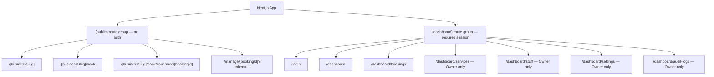
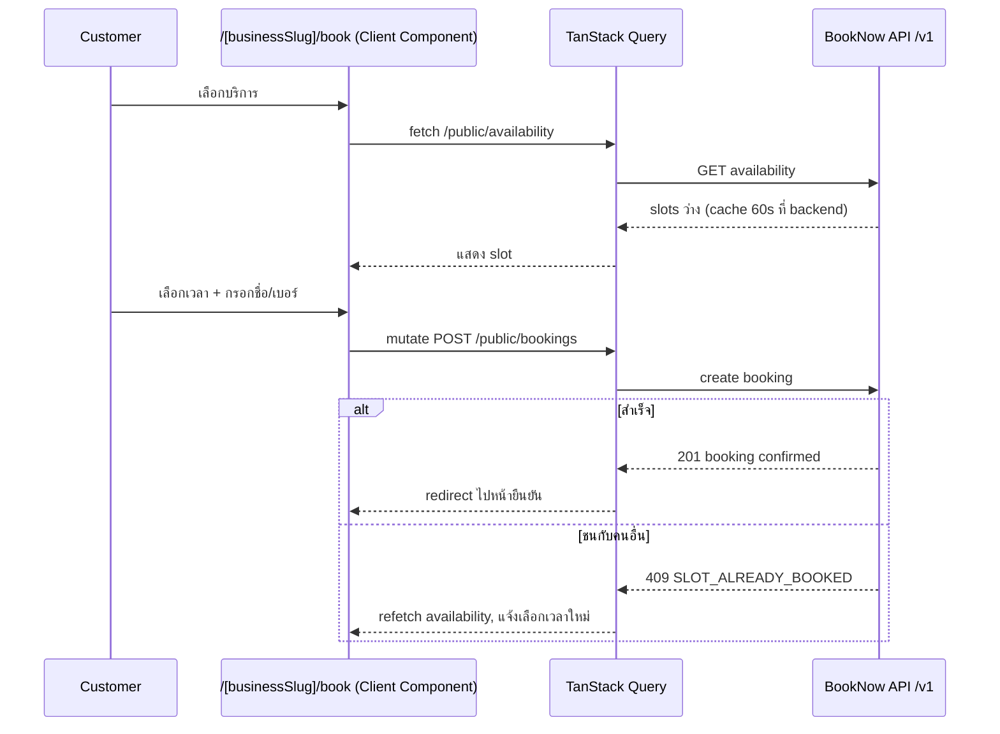

# Web Architecture — BookNow

> ตัวอย่างเอกสารสมบูรณ์ (product สมมติ) — ใช้เป็นแม่แบบสำหรับโปรเจกต์อื่น

**Product Name:** BookNow
**Platform:** Next.js Web Application (web-only ใน MVP)
**Primary Users:** Customer (ไม่ login), Business Owner, Staff
**Document Type:** Web Architecture Specification
**Primary Output:** Route Structure, Folder Structure, Data Fetching, Role-based UI Gating

## Status

| Field | Value |
|---|---|
| Document Status | Approved |
| Owner | Tech Lead |
| Reviewer | Frontend Team, Product Owner, UX/UI Designer |
| Last Updated | 2026-02-06 |
| Related | [Backend Architecture](../backend_architecture/backend_architecture.md), [API Spec](../api/api_spec.md), [Permission Requirements](../../04_requirements/permission_requirements.md), [PRD](../../03_product/prd/prd.md) |

---

## 0. Executive Summary

BookNow เป็น **web-only ใน MVP** ทั้งฝั่งลูกค้าและฝั่งธุรกิจ (Owner/Staff) ใช้ **Next.js เดียว** ทำหน้าที่ 2 บทบาทที่ต่างกันมาก:

1. **Public booking pages** — ลูกค้าเปิดจากลิงก์/QR code ที่ร้านแจก ต้องโหลดเร็ว, SEO-friendly (แม้ MVP ยังไม่ทำ marketplace discovery แต่หน้า booking ของแต่ละร้านควร index ได้เพื่อกรณีลูกค้า search ชื่อร้าน + "จองนัด") → ใช้ **Server-side Rendering (SSR) / static-friendly rendering**
2. **Owner/Staff dashboard** — ต้อง login, ข้อมูล real-time-ish (นัดวันนี้, สถานะ), interaction เยอะ (filter, mark complete) → ใช้ **client-side rendering + TanStack Query**

Next.js (App Router) รองรับทั้ง 2 โหมดในโปรเจกต์เดียวได้ด้วย Server Components สำหรับ public pages และ Client Components สำหรับ dashboard — ไม่ต้องแยกเป็น 2 โปรเจกต์

**Native mobile app ไม่อยู่ใน MVP scope** — ดูข้อ 8

---

## 1. Purpose

เอกสารนี้ใช้เพื่อ:

- กำหนด Next.js app structure ของ BookNow web
- แยก public routes (ไม่ auth) กับ authenticated dashboard routes (Owner/Staff)
- กำหนด data-fetching และ state management pattern
- อธิบายวิธี gate UI ตาม role โดยไม่ fetch ข้อมูลที่ผู้ใช้ไม่มีสิทธิ์เห็น
- ยืนยันเหตุผลที่ native mobile app ไม่อยู่ใน MVP scope

---

## 2. Business Value

| Architecture Area | Business Value |
|---|---|
| SSR สำหรับ public booking pages | โหลดเร็ว ลด bounce rate ของลูกค้าที่กดลิงก์จาก SMS/QR code |
| Dashboard แยก data-fetching ด้วย TanStack Query | Owner/Staff เห็นข้อมูลอัปเดตโดยไม่ reload หน้าเต็ม |
| Role-based UI gating ที่ระดับ fetch ไม่ใช่แค่ UI | ป้องกันข้อมูลรั่วผ่าน network tab แม้ UI ซ่อนไว้แล้ว |
| Next.js เดียวทำ 2 บทบาท | ลดต้นทุน infra/deploy เทียบกับแยก 2 โปรเจกต์ใน MVP |
| Responsive web แทน native app | ครอบคลุม customer + staff ได้ในงบ/เวลาที่จำกัดของ MVP |

---

## 3. Route Structure

### 3.1 Public Routes (ไม่ Auth)

| Route | Purpose | Rendering |
|---|---|---|
| `/[businessSlug]` | หน้าแรกของร้าน (ชื่อร้าน, บริการ, ปุ่มจอง) | SSR |
| `/[businessSlug]/book` | เลือกบริการ → พนักงาน → เวลา → กรอกข้อมูล → ยืนยัน (multi-step) | Client Component ภายใน SSR shell (ต้อง interactive สูงเพราะ real-time availability) |
| `/[businessSlug]/book/confirmed/[bookingId]` | หน้ายืนยันสำเร็จ พร้อมลิงก์จัดการนัด | SSR |
| `/manage/[bookingId]` | จัดการนัด (ดู/เลื่อน/ยกเลิก) — ต้องมี `?token=` ใน query | Client Component (ตรวจ token ฝั่ง client เรียก API ตรง, ไม่ต้อง SSR เพราะเป็น private ต่อ booking อยู่แล้วไม่ต้อง SEO) |

### 3.2 Authenticated Dashboard Routes (Owner/Staff)

| Route | Purpose | Role ที่เข้าได้ |
|---|---|---|
| `/login` | Owner/Staff login | ทุกคน (ก่อน auth) |
| `/dashboard` | สรุปนัดวันนี้/พรุ่งนี้ | Owner, Staff |
| `/dashboard/bookings` | list นัดทั้งหมด (filter ตามวัน/สถานะ) | Owner, Staff |
| `/dashboard/bookings/[bookingId]` | รายละเอียดนัด + mark complete/no-show | Owner, Staff (เฉพาะของตัวเองถ้าไม่มี flag) |
| `/dashboard/services` | จัดการรายการบริการ | Owner เท่านั้น |
| `/dashboard/staff` | เชิญ/จัดการพนักงาน + permission flags | Owner เท่านั้น |
| `/dashboard/settings` | business profile, business hours, cutoff/grace period | Owner เท่านั้น |
| `/dashboard/audit-logs` | audit log ทั้งร้าน | Owner เท่านั้น |

### 3.3 Route Group Diagram



---

## 4. Folder Structure

```text
src/
  app/
    (public)/
      [businessSlug]/
        page.tsx                    # หน้าแรกร้าน (Server Component)
        book/
          page.tsx                  # booking flow (Client Component)
          confirmed/
            [bookingId]/page.tsx
      manage/
        [bookingId]/page.tsx        # จัดการนัดด้วย token
    (dashboard)/
      login/page.tsx
      dashboard/
        layout.tsx                  # sidebar + auth guard
        page.tsx                    # สรุปวันนี้
        bookings/
          page.tsx
          [bookingId]/page.tsx
        services/page.tsx
        staff/page.tsx
        settings/page.tsx
        audit-logs/page.tsx
    layout.tsx
  core/
    api/
      client.ts                     # typed REST client, แนบ Authorization/X-Booking-Token
      errors.ts
    auth/
      auth-provider.tsx              # JWT session context (Owner/Staff)
      protected-route.tsx            # redirect ไป /login ถ้าไม่มี session
      use-current-user.ts
    permissions/
      permission-provider.tsx        # role + flag (view_all_bookings/manage_all_bookings) context
      use-can.ts                     # hook เช็คสิทธิ์ก่อน render/fetch
  features/
    booking-flow/                    # public booking wizard
    availability/
    bookings/                        # dashboard booking list/detail
    services/
    staff/
    audit-logs/
  shared/
    components/
    layout/
    forms/
    empty-states/
```

หลักการแยก: `(public)` และ `(dashboard)` เป็น Next.js route group คนละ layout — public ไม่มี auth guard เลย, dashboard มี `protected-route` ครอบทุก route ใน `layout.tsx`

---

## 5. Data Fetching & State Strategy

| Context | Approach | เหตุผล |
|---|---|---|
| Public: หน้าแรกร้าน, รายการบริการ | Server Component fetch ตรงตอน render (SSR) | เร็ว, SEO, ไม่ต้องมี loading state สำหรับข้อมูลที่เปลี่ยนไม่บ่อย |
| Public: booking wizard (เลือกเวลา, ยืนยัน) | Client Component + TanStack Query | ต้อง refetch availability บ่อย (cache 60 วินาทีตาม backend, BR-005), ต้อง handle 409 conflict แบบ interactive |
| Dashboard: ทุกหน้า | Client Component + TanStack Query | ต้อง refetch/mutate บ่อย (mark complete, filter), invalidate cache หลัง mutation ทันที |
| Session (Owner/Staff) | React Context (`auth-provider`) + JWT ใน httpOnly cookie หรือ secure storage | อ่าน role/flags ได้ทุกที่โดยไม่ prop-drill |
| UI-only state (modal, filter draft) | local `useState` / URL search params | ไม่จำเป็นต้องมี global state library เพิ่มใน MVP |

เหตุผลที่ไม่ใช้ Server Component ทั้ง dashboard: ข้อมูล dashboard เปลี่ยนบ่อยจาก action ของผู้ใช้เอง (mark complete, filter แบบ real-time) TanStack Query ให้ cache invalidation/optimistic update ที่เหมาะกับ interaction pattern นี้มากกว่า re-render ทั้งหน้าแบบ Server Component

### 5.1 ตัวอย่าง Query Key Convention

```text
['availability', businessSlug, serviceId, staffId, date]
['bookings', 'today', businessId]
['bookings', bookingId]
['services', businessId]
['staff', businessId]
['audit-logs', businessId, { cursor }]
```

Invalidate `['bookings', ...]` ทุกครั้งที่ mutation สำเร็จ (create/reschedule/cancel/complete/no-show) เพื่อให้ dashboard อัปเดตทันที

---

## 6. Role-based UI Gating

หลักสำคัญ (ตรงกับแนวทางใน [Permission Requirements](../../04_requirements/permission_requirements.md)): **ต้องไม่ fetch ข้อมูลที่ผู้ใช้ไม่มีสิทธิ์เห็นตั้งแต่แรก** ไม่ใช่แค่ซ่อนปุ่ม/component ใน UI เพราะข้อมูลที่ fetch มาแล้วซ่อนไว้ยังรั่วผ่าน network tab/React DevTools ได้

### 6.1 Permission Provider

`permission-provider.tsx` เก็บ role และ flags (`viewAllBookings`, `manageAllBookings`) จาก JWT/response ตอน login แล้ว expose hook `useCan(action)`:

```ts
const canSeeAllBookings = useCan('view_all_bookings');
const canManageService = useCan('manage_service'); // true เฉพาะ Owner เสมอ
```

### 6.2 Gate ที่ Query Layer ไม่ใช่แค่ Component Layer

```ts
// features/bookings/use-bookings-list.ts
function useBookingsList(filters: BookingFilters) {
  const { role, staffId, viewAllBookings } = useCurrentUser();

  const scopedFilters =
    role === 'staff' && !viewAllBookings
      ? { ...filters, staffId }   // บังคับ scope ที่ client เพื่อ UX ที่ถูกต้องทันที
      : filters;

  return useQuery({
    queryKey: ['bookings', scopedFilters],
    queryFn: () => api.bookings.list(scopedFilters),
    enabled: Boolean(role),        // ไม่ fetch ก่อนรู้ role
  });
}
```

หมายเหตุสำคัญ: การ filter ฝั่ง client นี้เป็นเพื่อ UX (แสดงผลถูกต้องทันทีไม่ต้องรอ error) **backend ต้อง enforce scope นี้ซ้ำที่ query level เสมอ** (ตาม BR-004 และ [API Spec](../api/api_spec.md) หัวข้อ 5) — frontend ไม่ใช่ชั้นที่ตัดสินความปลอดภัยจริง เป็นแค่ UX layer

### 6.3 Route-level Gating

หน้าที่ Owner เท่านั้นเข้าได้ (`/dashboard/services`, `/dashboard/staff`, `/dashboard/settings`, `/dashboard/audit-logs`) ต้องเช็ค role ที่ `layout.tsx` ของแต่ละ route group ก่อน render เนื้อหา และก่อนยิง query ใดๆ — ถ้า Staff พยายามเข้าตรง URL ให้ redirect ไป `/dashboard` พร้อม toast แจ้งไม่มีสิทธิ์ ไม่ใช่ render หน้าเปล่าที่ query แล้ว fail

### 6.4 Permission UI States

| State | UI |
|---|---|
| `allowed` | แสดงเนื้อหาปกติ |
| `role_forbidden` | redirect ออกจาก route หรือแสดง "ไม่มีสิทธิ์เข้าถึง" ทันที ไม่ fetch data |
| `loading` (รอรู้ role จาก session) | skeleton, ไม่ fetch data ย่อยจนกว่าจะรู้ role (`enabled: Boolean(role)`) |
| `token_invalid` (customer manage page) | แสดง "ลิงก์นี้ไม่ถูกต้องหรือหมดอายุแล้ว" |

---

## 7. Public Booking Flow (Customer-facing)



---

## 8. Native Mobile App: ไม่อยู่ใน MVP Scope

ตาม [PRD](../../03_product/prd/prd.md) หัวข้อ Out of Scope และ [Product Context](../../00_overview/product_context.md) หัวข้อ 5 ระบุชัดว่า MVP เป็น **web-only** — native mobile app อยู่ใน **Phase 2** ของ Roadmap เท่านั้น

เหตุผลที่ web responsive พอสำหรับ MVP:

- **ลูกค้า**: เข้าถึงผ่านลิงก์/QR code ที่ร้านแจก ไม่ใช่ app ที่ต้องดาวน์โหลดล่วงหน้า — responsive web ให้ friction ต่ำกว่า (ไม่ต้องติดตั้ง) ซึ่งตรงกับ pain point หลักคือ "จองง่ายกว่าโทร"
- **Staff**: ใช้ดูตารางนัด/mark complete ซึ่งเป็น action ไม่บ่อยและไม่ต้องการ native feature (push notification แบบ native, offline mode) ที่คุ้มค่าจะสร้าง native app ตั้งแต่ MVP
- **Owner**: ใช้งานหลักบนคอมพิวเตอร์/แท็บเล็ตที่ร้าน responsive web ครอบคลุมได้เต็มรูปแบบ
- การสร้าง native app เพิ่มต้นทุน dev/maintenance คู่ (iOS + Android) ที่ไม่คุ้มก่อนพิสูจน์ product-market fit — สอดคล้องกับหลักการ MVP ของ PRD ที่ต้อง "เห็นผลได้ใน 1 วันที่ตั้งค่า"

Next.js/React architecture ในเอกสารนี้ (โดยเฉพาะ API client แยกจาก UI ใน `core/api/`) ออกแบบให้พร้อมต่อยอดเป็น React Native app ใน Phase 2 โดยใช้ API เดียวกัน (`/v1`) ได้โดยไม่ต้องแก้ backend

---

## 9. Accessibility & Responsive Considerations

- Booking wizard ต้องใช้งานได้ดีบนมือถือเป็นหลัก (ลูกค้าส่วนใหญ่เปิดจากลิงก์ SMS บนมือถือ) — mobile-first layout สำหรับ `(public)` route group
- Dashboard ออกแบบ desktop-first แต่ responsive พอสำหรับแท็บเล็ตหน้าร้าน
- ปุ่ม mark complete/no-show ต้องมีขนาดกดง่ายบนมือถือ (Staff อาจเช็คจากมือถือระหว่างทำงาน)
- Time slot picker ต้องรองรับ keyboard navigation สำหรับ accessibility

---

## 10. Testing Considerations

| Test Type | Coverage |
|---|---|
| Unit | permission hooks (`useCan`), date/time formatting (timezone ธุรกิจ), validation schema |
| Component | booking wizard steps, dashboard tables, permission-gated components |
| Integration | booking flow กับ mocked API รวม 409 conflict path |
| E2E | ลูกค้าจองนัดสำเร็จ, ลูกค้าจองชนกัน (409), ลูกค้ายกเลิกผ่าน token link, Staff เห็นเฉพาะนัดตัวเอง, Owner เห็นทั้งหมด, Staff เข้า `/dashboard/services` ตรง URL ถูก redirect |

### Critical E2E Flows

1. ลูกค้าเปิดลิงก์ร้าน → เลือกบริการ/เวลา → จองสำเร็จ → ได้ลิงก์จัดการนัด
2. ลูกค้าสองคนพยายามจองเวลาเดียวกันพร้อมกัน → คนที่สองเห็น error และเลือกเวลาใหม่ได้
3. ลูกค้าเปิดลิงก์จัดการนัด → ยกเลิกก่อน/หลัง cutoff → เห็นผลต่างกันถูกต้อง
4. Staff login → เห็นเฉพาะนัดตัวเอง → mark complete
5. Owner login → เห็นนัดทั้งร้าน → เปิด audit log
6. Staff พยายามเข้า `/dashboard/staff` ตรง URL → ถูก redirect ไม่มี request ยิงไปหา staff list API

---

## 11. Deployment Considerations

- Next.js deploy เป็น single app (SSR + client) — ไม่ต้องแยก static hosting กับ dashboard
- Environment-based API base URL (`NEXT_PUBLIC_API_URL`)
- ไม่ log PHI-เทียบเท่า (เบอร์โทร/อีเมลลูกค้า) ใน client-side error tracking โดยไม่จำเป็น
- Session timeout สำหรับ dashboard: refresh token 30 วัน ตาม [Backend Architecture](../backend_architecture/backend_architecture.md) หัวข้อ 8

---

## 12. Product and Web Decisions

| Decision | Choice | Reasoning |
|---|---|---|
| Framework | Next.js (App Router) | รองรับทั้ง SSR public pages และ client-heavy dashboard ในโปรเจกต์เดียว |
| Data fetching | Server Component (public, static-ish) + TanStack Query (dashboard, booking wizard) | เลือกตามลักษณะข้อมูล ไม่ over-engineer ทุกหน้าเป็น client-only |
| Client state | React Context + local state | ยังไม่จำเป็นต้องมี global state library ใน MVP |
| Permission gating | ที่ query layer + route layer ไม่ใช่แค่ component ซ่อน | ป้องกันข้อมูลรั่วผ่าน network, ตรงหลัก fail-closed |
| Mobile | Responsive web เท่านั้น, native app เลื่อนไป Phase 2 | ตรงตาม PRD scope, ลดต้นทุนก่อนพิสูจน์ PMF |

---

## 13. Open Questions

- ควรทำ PWA (installable web app) เพื่อลด gap กับ native app ให้ Staff ใน Phase ถัดไปก่อนลงทุนสร้าง native จริงหรือไม่
- Booking wizard ควร prefetch availability ของวันถัดไปล่วงหน้าไหมเพื่อ UX ลื่นขึ้น (แลกกับ request ที่เพิ่มขึ้นต่อ rate limit ฝั่ง public API)
- Dashboard ต้องรองรับ offline/slow-network mode สำหรับร้านที่ wifi ไม่แรงหรือไม่ (ยังไม่ระบุใน PRD)

---

## 14. Linked Docs

- [Backend Architecture](../backend_architecture/backend_architecture.md)
- [Database Schema](../database/database_schema.md)
- [API Spec](../api/api_spec.md)
- [PRD](../../03_product/prd/prd.md)
- [Permission Requirements](../../04_requirements/permission_requirements.md)
- [Product Context](../../00_overview/product_context.md)
